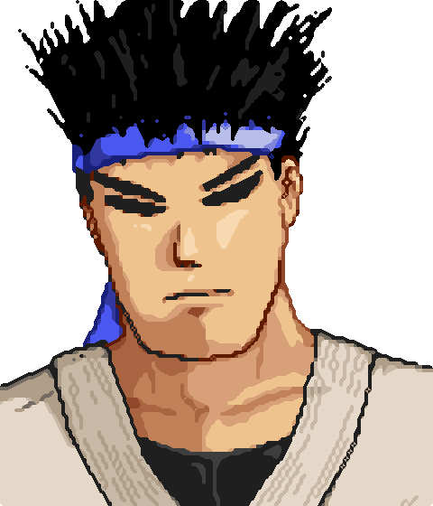
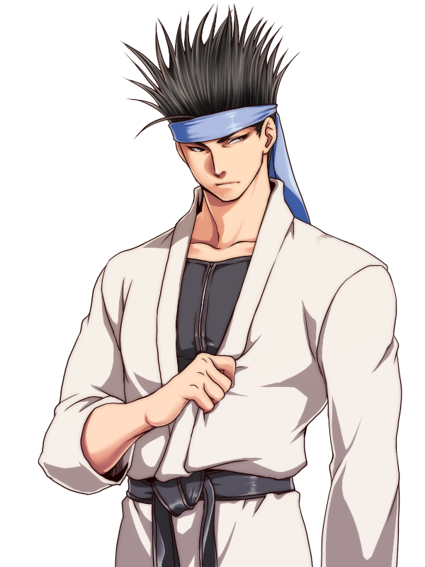
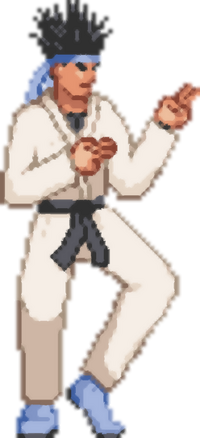

# Kung Fu Man

## Info

**Name:** Kung Fu Man

**Gender:** Male

## Concepts

## Synopsis

Kung Fu Man's story begins with himself and his girlfriend going for a walk. Sometime during this walk, they are ambushed by Suave Dude and his minions; of course, Kung Fu Man fends off Suave Dude's minions, though while he is preoccupied, Suave Dude captures Kung Fu Man's girlfriend and retreats back to his secret hideout. In order to get his girlfriend back, Kung Fu Man sets off for Suave Dude's hideout, letting nothing stand in his way.

> [!TIP]
> Read more about him [here](https://mugen.fandom.com/wiki/Kung_Fu_Man)

## Move List

|Motion|Command|Name|Notes|Reference|
|:----:|:----:|:----:|:----:|:----:|
| | `236P` | TBD | Fireball | |
| | `326P` | TBD | Dragon Punch | |
| | `214P` | TBD | Tatsu | |
