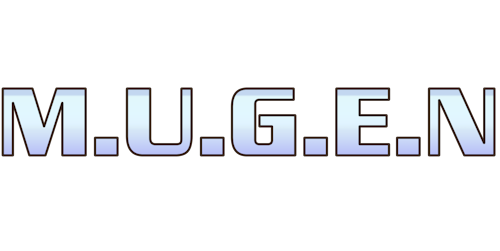

 

# Game Design / Wiki

 

**Working Title:** Docs Template Mugen

**Icon:** 

**Genre:** [2D Fighting Game](https://glossary.infil.net/?t=2D%20Game)

**Theme:** _The main theme. Any sub-themes._

**Audience:** _Who is this game for?_

**Visual Style:** _How will the game look? How will the visuals make the player feel? Include inspiration/references & guidance for the artists._

**Music & Sound Style:**  _How will the game sound for both sound effects and the general musical soundscape? How will the audio make the player feel? Include inspiration/references & guidance for the sound designers_

**Story:** _Overview of the main story beats, beginning middle and end, story progression, player character journey and development, plus other significant characters and their arc. Include world-building points, time/place, key landmarks, key exclusions or deviations from known worlds._

**Engine**: _Which game engine will be used?_

**Platform:** _How will the game be accessed/played?_

**Key Pillars:** _Key emotions/ experiences you want for the player. Keep these short - single words or short phrases. Always refer back to these pillars throughout the design and development process._

**Mechanics:** see [Systems 🔗](./systems/index.md) page

**Features:** see [Game Modes 🔗](./game_design/game_modes.md) page

**Game Design:** see [Design Document 🔗](./game_design/overview.md) page

 

# Characters

 

[!include]
