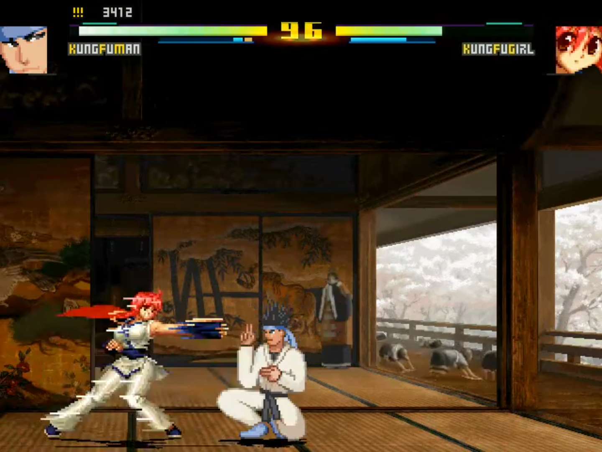

# Battle Mechanics

|  |
|:--:|
| *battle screen* |

> [!NOTE]
> **💡**: Add some important note!

## Blocking

> Hold  or  while standing close to an opponent attack.

Blocking (or guarding) is the fundamental form of defense in fighting games...

## Throws
> Press
> 

> [!NOTE]
> Hold  to throw your opponent backward on connect.

Throws are...
