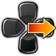
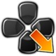
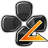
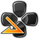

# Controls

Regardless of control type, move in 8 directions (cardinals & diagonals) using the D-pad or joystick.

Hold back to block Overhead and Mid attacks or down and back to block Mid and Low attacks.

## Directions

#### DPad

||||
|:---:|:---:|:---:|
||||
||||
||||

## Basic Attacks

This is a six attack button fighting game, with attack buttons spited into two categories, **punches** and **kicks**:

- **Punches:** Light Punch (`LP`), Medium Punch (`MP`), Heavy Punch (`HP`).
- **Kicks:** Light Kick (`LK`), Medium Kick (`MK`), Heavy Kick (`HK`).

### Button Notation

|Name|Notation|Icon|
|:-------------|:-----|:-----------|
| Light Punch  | `LP` |  |
| Medium Punch | `MP` |  |
| Heavy Punch  | `HP` |  |
| Any Punch    | `P`  |  |
| Light Kick   | `LK` |  |
| Medium Kick  | `MK` |  |
| Heavy Kick   | `HK` |  |
| Any Kick     | `K`  |  |

### Motion Notation

|Name|Notation|NumPad|Icon|
|:-----------------------|:--------------|:--------|:--------------------------|
| Quarter Circle Forward | `QCF`         | `236`   |  |
| Quarter Circle Back    | `QCB`         | `214`   |  |
| Half Circle Forward    | `HCF`         | `41236` |  |
| Half Circle Back       | `HCB`         | `63214` |  |
| Dragon Punch           | `DP`          | `623`   |   |
| Reverse Dragon Punch   | `RDP`         | `421`   |  |
| Full-Circle            | `360` / `SPD` | `360`   |  |

