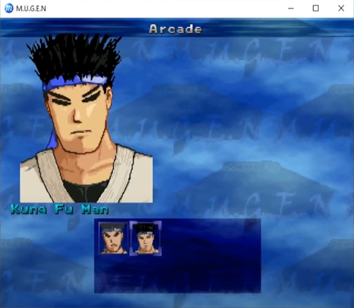
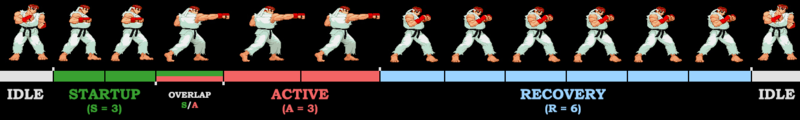

# Game Data

## Characters

|  |
|:--:|
| *select screen* |

The characters are divided into well known archetypes like rushdown, zoner, shoto...

## Frame Data

The word "frame" is used to represent the smallest unit of time in the game. In this game and most fighting games, one frame is 1/60 of a second, since the game runs at 60 frames per second. Every action a character takes, like walking, jumping, attacking, or blocking, can be measured in terms of frames. Frames are often abbreviated with the letter "f", as in 60f = 60 frames.

Keeping in mind that all actions are measured in frames, moves can be further divided into phases called Startup, Active, and Recovery. Knowing the definition of each will make it much easier to interpret Frame Data.

- **Startup:** The beginning portion of an attack before it can hit the opponent; think "winding up for a punch"
- **Active:** The portion of an attack that can hit or grab the opponent
- **Recovery:** The ending portion of an attack that can no longer connect with the opponent, and the attacker is unable to perform any other action such as blocking.

## Counter-Hit

A [**Counter-Hit**](https://glossary.infil.net/?t=Counter%20Hit) occurs when you attack your opponent during their startup or active frames. Attacks that trade with each other both land as a **Counter-Hit**. A "_Counter Hit_" icon appears on either the P1 or P2 side of the screen, depending on who landed the hit.

**Counter-Hits** deal an additional `10%` damage and add `+2` to the frame advantage...

